

# TankTrouble Network Optimization

**Richer, more real-time and more accurate network display — plus real optimization.**

[**⬇ Install**](https://raw.githubusercontent.com/L-Shy-P/TankTrouble-Network-Optimization/main/tanktrouble-netlab.user.js) · [**⬇ Download**](https://github.com/L-Shy-P/TankTrouble-Network-Optimization/raw/main/tanktrouble-netlab.install.user.js) · [**📖 English guide**](docs/README.en.md) · [简体中文](docs/README.zh.md)

---

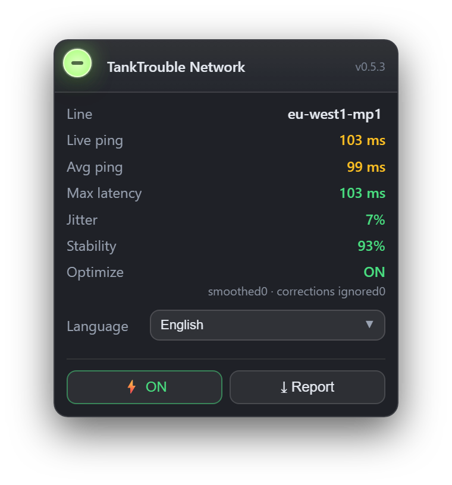 

## 🌐 Languages · 多语言

| | |
|---|---|
| 🇬🇧 | [English](docs/README.en.md) |
| 🇨🇳 | [中文](docs/README.zh.md) |
| 🇯🇵 | [日本語](docs/README.ja.md) |
| 🇰🇷 | [한국어](docs/README.ko.md) |
| 🇷🇺 | [Русский](docs/README.ru.md) |
| 🇸🇦 | [العربية](docs/README.ar.md) |
| 🇫🇷 | [Français](docs/README.fr.md) |
| 🇪🇸 | [Español](docs/README.es.md) |
| 🇩🇪 | [Deutsch](docs/README.de.md) |
| 🇧🇷 | [Português](docs/README.pt.md) |
| 🇻🇳 | [Tiếng Việt](docs/README.vi.md) |

---

## ✨ Main features

| | |
|---|---|
| **Richer** · 更丰富 | line / avg / **live** / max / jitter / stalls / stability — one panel, updating live |
| **More real-time** · 更实时 | a dedicated **2-second ping probe** measures the real RTT (frame intervals are *not* latency) |
| **More accurate** · 更准确 | real stalls (TCP head-of-line blocking) are told apart from lobby / between-rounds idle gaps |
| **Real optimization** · 真优化 | render-time smoothing + local authority + dead reckoning, with a **live A/B switch** (⚡) |

**No server, no network configuration, not a VPN.** A pure client-side Tampermonkey userscript —
the game server sees exactly the same bytes as before.

---

## 📦 What it does (11 languages)

<b>🇬🇧 English</b> — TankTrouble Network Optimization

 

A Tampermonkey userscript for **tanktrouble.com**: it shows what your connection is really doing, and turns the TCP head-of-line-blocking "freeze → teleport" into a smooth glide.

**No server, no network configuration, not a VPN.** Pure client-side — the server sees exactly the same bytes as before.

The optimization only changes *what you see*: the position is smoothed at render time, while the game logic, physics and server validation always use the real values. Your own tank is locally authoritative, so a reconnect will not drag you back.

👉 **[Open the English page](docs/README.en.md)**

<b>🇨🇳 中文</b> — TankTrouble 网络优化

> [!TIP]
> 想要在 TankTrouble 里发送 **中文** 吗？我做了一款多语言聊天扩展！👉 [TankTrouble-Chat-Unblock](https://github.com/L-Shy-P/TankTrouble-Chat-Unblock)

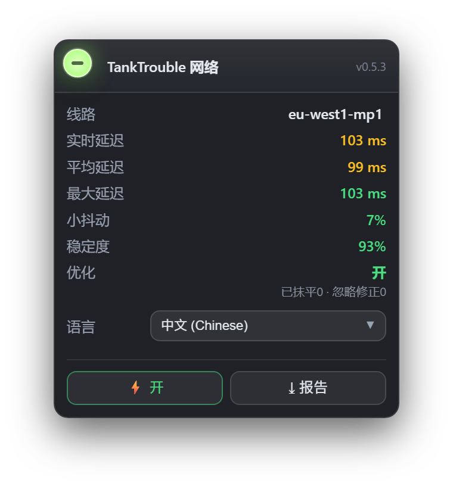 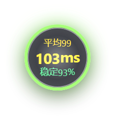

给 **tanktrouble.com** 写的油猴脚本：把你这局的网络情况如实显示出来，并把 TCP 队头阻塞造成的「僵住 → 瞬移」抹平成滑行。

**不用服务器、不用改任何网络配置、不是加速器**：纯客户端，服务端看到的数据一个字节都没变。

优化只改**你看到的东西**：渲染那一瞬间的位置被平滑，游戏逻辑 / 物理 / 服务端校验全程用真值；你自己的坦克以本地为准，断线重连不会被拉回去。

👉 **[进入本语言页面（中文）](docs/README.zh.md)**

<b>🇯🇵 日本語</b> — TankTrouble ネットワーク最適化

> [!TIP]
> TankTrouble で **日本語** を送りたい？多言語チャット拡張を作りました！👉 [TankTrouble-Chat-Unblock](https://github.com/L-Shy-P/TankTrouble-Chat-Unblock)

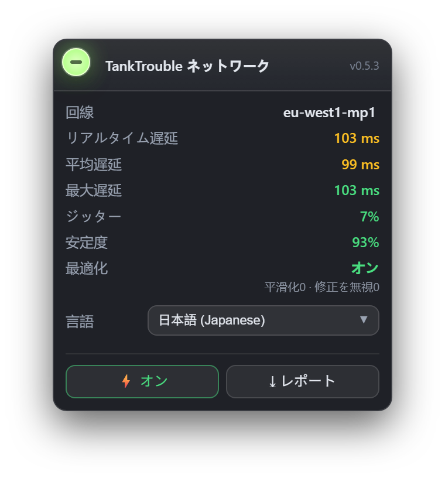 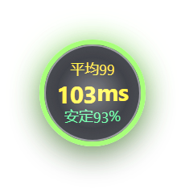

**tanktrouble.com** 用の Tampermonkey ユーザースクリプト。回線の実情を表示し、TCP の隊頭ブロッキングによる「固まる → ワープ」を滑らかな移動に変えます。

**サーバー不要・ネットワーク設定不要・VPN ではありません。** 完全にクライアント側で、サーバーが見るデータは 1 バイトも変わりません。

最適化が変えるのは*見た目だけ*：描画の瞬間だけ位置を滑らかにし、ゲームロジック・物理・サーバー検証は常に真値を使います。自分の戦車はローカル優先なので、再接続後も引き戻されません。

👉 **[日本語ページを開く](docs/README.ja.md)**

<b>🇰🇷 한국어</b> — TankTrouble 네트워크 최적화

> [!TIP]
> TankTrouble에서 **한국어**를 보내고 싶으신가요? 다국어 채팅 확장을 만들었습니다! 👉 [TankTrouble-Chat-Unblock](https://github.com/L-Shy-P/TankTrouble-Chat-Unblock)

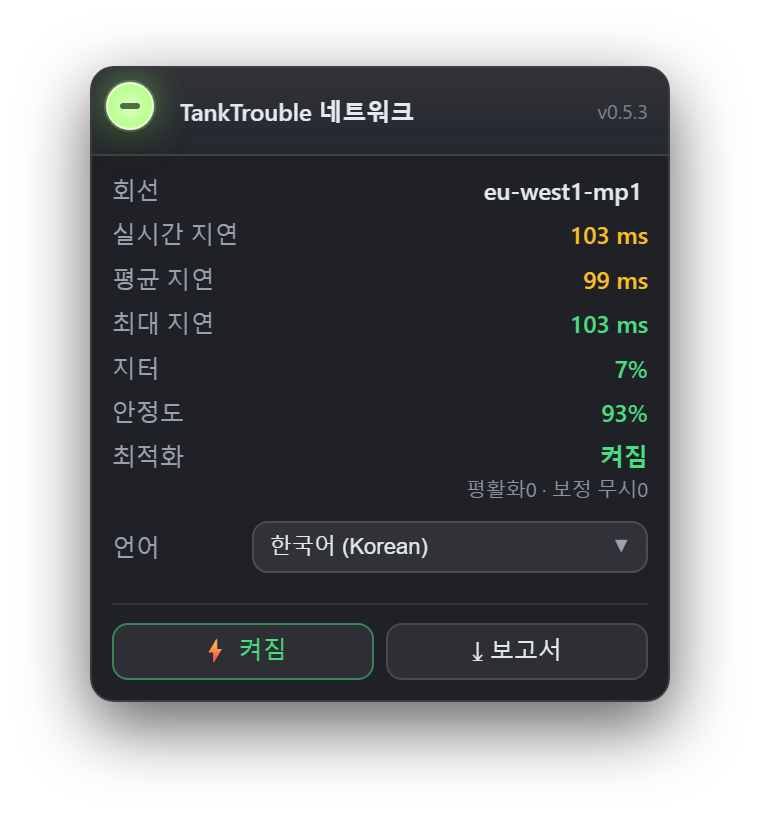 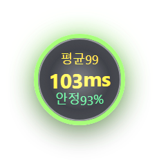

**tanktrouble.com**용 Tampermonkey 사용자 스크립트입니다. 회선 상태를 있는 그대로 보여주고, TCP 헤드오브라인 블로킹으로 생기는 "멈춤 → 순간이동"을 부드러운 이동으로 바꿉니다.

**서버 불필요, 네트워크 설정 불필요, VPN 아님.** 순수 클라이언트이며 서버가 보는 데이터는 1바이트도 바뀌지 않습니다.

최적화가 바꾸는 것은 *보이는 것*뿐입니다. 렌더링 순간의 위치만 부드럽게 하고, 게임 로직·물리·서버 검증은 항상 실제 값을 씁니다. 내 탱크는 로컬 기준이라 재접속해도 끌려가지 않습니다.

👉 **[한국어 페이지 열기](docs/README.ko.md)**

<b>🇷🇺 Русский</b> — TankTrouble — оптимизация сети

> [!TIP]
> Хотите писать **по-русски** в TankTrouble? Я сделал многоязычное расширение для чата! 👉 [TankTrouble-Chat-Unblock](https://github.com/L-Shy-P/TankTrouble-Chat-Unblock)

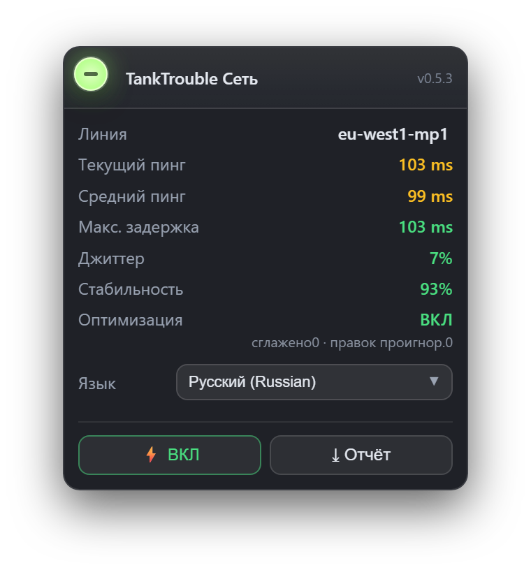 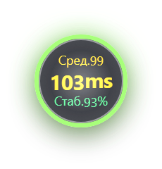

Пользовательский скрипт Tampermonkey для **tanktrouble.com**. Показывает реальное состояние соединения и превращает «зависание → телепорт» (блокировку головы очереди TCP) в плавное скольжение.

**Без сервера, без настройки сети, это не VPN.** Только клиент: сервер видит те же байты, что и раньше.

Оптимизация меняет только *то, что вы видите*: сглаживается позиция в момент отрисовки, а логика, физика и проверка на сервере всегда используют истинные значения. Ваш танк — локально авторитетный, поэтому после переподключения вас не отбросит назад.

👉 **[Открыть страницу на русском](docs/README.ru.md)**

<b>🇸🇦 العربية</b> — TankTrouble — تحسين الشبكة

> [!TIP]
> هل تريد إرسال **العربية** في TankTrouble؟ لقد صنعت إضافة دردشة متعددة اللغات! 👉 [TankTrouble-Chat-Unblock](https://github.com/L-Shy-P/TankTrouble-Chat-Unblock)

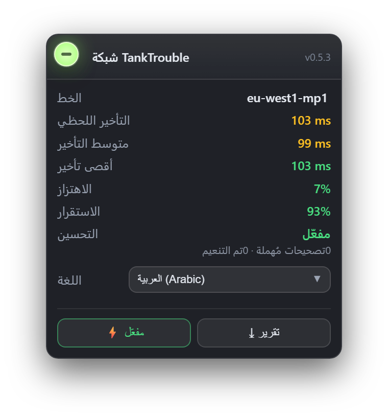 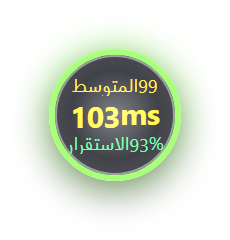

سكربت Tampermonkey لموقع **tanktrouble.com**. يعرض حالة اتصالك الحقيقية ويحوّل لحظات «التجمّد ← الانتقال المفاجئ» الناتجة عن احتجاز رأس الطابور في TCP إلى انزلاق سلس.

**بدون سيرفر، بدون أي إعدادات شبكة، وليس VPN.** كل شيء في المتصفح: الخادم يرى نفس البيانات بايت ببايت.

التحسين يغيّر *ما تراه فقط*: يتم تنعيم الموضع لحظة الرسم، بينما المنطق والفيزياء والتحقق على الخادم تستخدم القيم الحقيقية دائمًا. دبابتك محليّة السلطة، لذا لن يعيدك الخادم بعد انقطاع.

👉 **[افتح الصفحة العربية](docs/README.ar.md)**

<b>🇫🇷 Français</b> — TankTrouble — optimisation réseau

> [!TIP]
> Envie d'écrire **en français** dans TankTrouble ? J'ai fait une extension de chat multilingue ! 👉 [TankTrouble-Chat-Unblock](https://github.com/L-Shy-P/TankTrouble-Chat-Unblock)

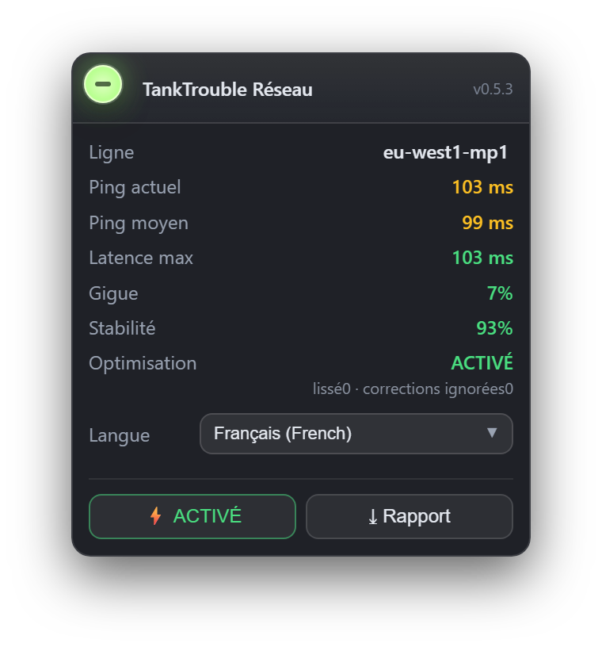 

Un userscript Tampermonkey pour **tanktrouble.com**. Il montre ce que fait vraiment votre connexion et transforme les « blocages → téléportation » du blocage de tête de file TCP en un glissement fluide.

**Pas de serveur, aucune configuration réseau, pas un VPN.** Tout est côté client : le serveur voit exactement les mêmes octets.

L'optimisation ne change que *ce que vous voyez* : la position est lissée au moment du rendu, tandis que la logique, la physique et la validation serveur utilisent toujours les vraies valeurs. Votre tank est localement autoritaire : pas de retour en arrière après une reconnexion.

👉 **[Ouvrir la page en français](docs/README.fr.md)**

<b>🇪🇸 Español</b> — TankTrouble — optimización de red

> [!TIP]
> ¿Quieres escribir **en español** en TankTrouble? ¡Hice una extensión de chat multilingüe! 👉 [TankTrouble-Chat-Unblock](https://github.com/L-Shy-P/TankTrouble-Chat-Unblock)

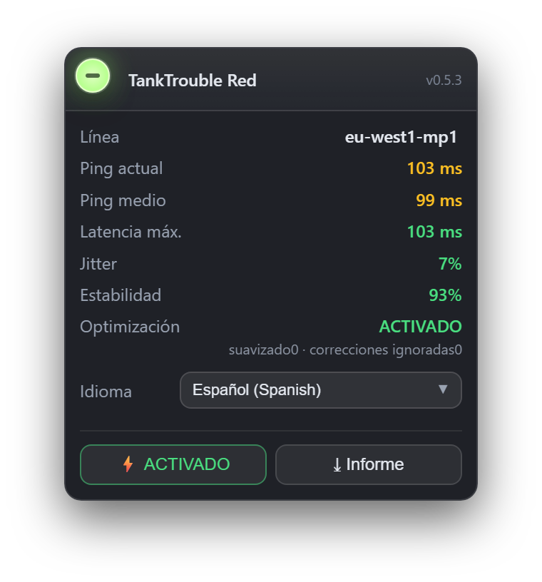 

Un userscript de Tampermonkey para **tanktrouble.com**. Muestra lo que hace de verdad tu conexión y convierte los «congelamientos → teletransportes» del bloqueo de cabeza de cola de TCP en un deslizamiento suave.

**Sin servidor, sin configurar la red, no es una VPN.** Todo es del lado del cliente: el servidor ve exactamente los mismos bytes.

La optimización solo cambia *lo que ves*: la posición se suaviza en el momento del render, mientras que la lógica, la física y la validación del servidor usan siempre los valores reales. Tu tanque es de autoridad local: tras reconectar no te devuelven atrás.

👉 **[Abrir la página en español](docs/README.es.md)**

<b>🇩🇪 Deutsch</b> — TankTrouble — Netzwerk-Optimierung

> [!TIP]
> Willst du **auf Deutsch** in TankTrouble schreiben? Ich habe eine mehrsprachige Chat-Erweiterung gebaut! 👉 [TankTrouble-Chat-Unblock](https://github.com/L-Shy-P/TankTrouble-Chat-Unblock)

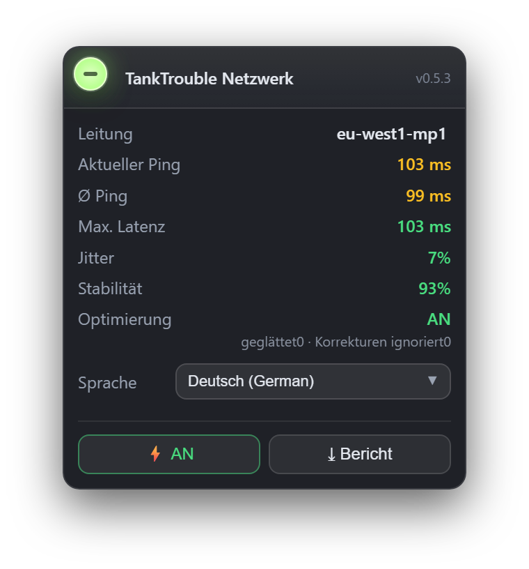 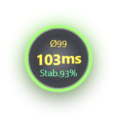

Ein Tampermonkey-Userscript für **tanktrouble.com**. Es zeigt, was deine Verbindung wirklich macht, und verwandelt „Hänger → Teleport“ durch TCP-Head-of-Line-Blocking in ein weiches Gleiten.

**Kein Server, keine Netzwerkkonfiguration, kein VPN.** Rein clientseitig: der Server sieht exakt dieselben Bytes.

Die Optimierung ändert nur *das, was du siehst*: die Position wird im Moment des Renderns geglättet, während Logik, Physik und Serverprüfung immer die echten Werte nutzen. Dein Panzer ist lokal autoritativ — nach einem Reconnect wirst du nicht zurückgezogen.

👉 **[Deutsche Seite öffnen](docs/README.de.md)**

<b>🇧🇷 Português</b> — TankTrouble — otimização de rede

> [!TIP]
> Quer escrever **em português** no TankTrouble? Eu fiz uma extensão de chat multilíngue! 👉 [TankTrouble-Chat-Unblock](https://github.com/L-Shy-P/TankTrouble-Chat-Unblock)

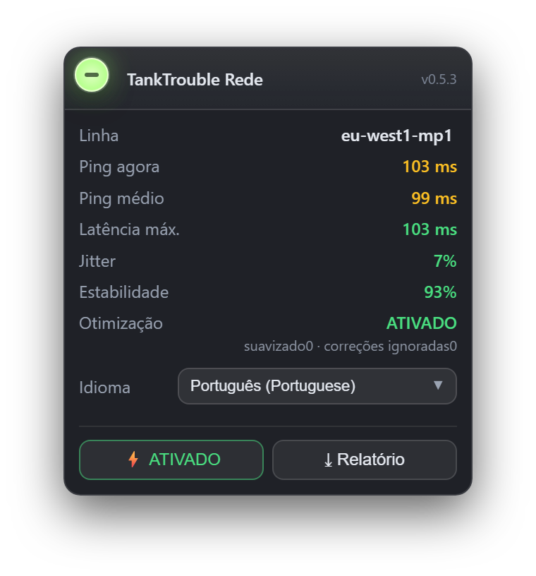 

Um userscript de Tampermonkey para **tanktrouble.com**. Mostra o que a sua conexão realmente faz e transforma os “travamentos → teleportes” do bloqueio de cabeça de fila do TCP em um deslize suave.

**Sem servidor, sem configurar a rede, não é VPN.** Tudo no cliente: o servidor vê exatamente os mesmos bytes.

A otimização muda apenas *o que você vê*: a posição é suavizada no momento do render, enquanto a lógica, a física e a validação do servidor usam sempre os valores reais. Seu tanque é de autoridade local: após reconectar você não é puxado de volta.

👉 **[Abrir a página em português](docs/README.pt.md)**

<b>🇻🇳 Tiếng Việt</b> — TankTrouble — tối ưu hóa mạng

> [!TIP]
> Muốn gửi **tiếng Việt** trong TankTrouble? Tôi đã làm một tiện ích chat đa ngôn ngữ! 👉 [TankTrouble-Chat-Unblock](https://github.com/L-Shy-P/TankTrouble-Chat-Unblock)

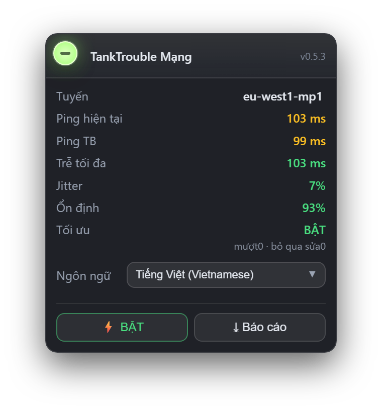 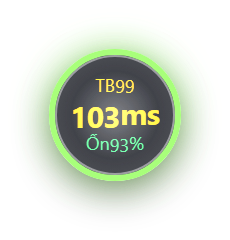

Userscript Tampermonkey cho **tanktrouble.com**: hiển thị chính xác tình trạng kết nối của bạn và biến tình trạng tắc nghẽn TCP (đứng hình → dịch chuyển tức thời) thành chuyển động mượt.

**Không cần máy chủ, không cần cấu hình mạng, không phải VPN.** Chạy hoàn toàn phía client — máy chủ nhận đúng từng byte như trước.

Tối ưu hóa chỉ thay đổi *những gì bạn thấy*: vị trí được làm mượt lúc render, còn logic game, vật lý và xác thực máy chủ luôn dùng giá trị thật. Xe tăng của bạn do máy bạn quyết định, nên khi kết nối lại sẽ không bị kéo ngược.

👉 **[Mở trang tiếng Việt](docs/README.vi.md)**

---

## 🔗 Links

* [Language guides — 11 languages](docs/README.en.md)
* [Technical notes — how it works & the dead ends (中文)](docs/TECHNICAL.zh.md)
* [Changelog](tanktrouble-netlab.user.js) — see the `CHANGELOG` constant in the script
* [License (MIT)](LICENSE)

> ⚠️ Not affiliated with TankTrouble. A fan-made diagnostics / optimization tool.
