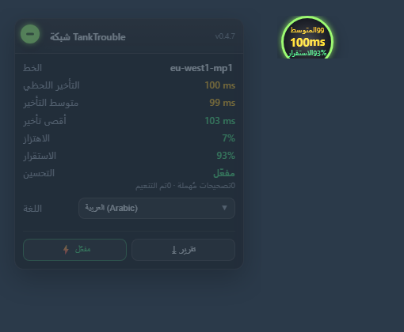

# 🇸🇦 TankTrouble — تحسين الشبكة

> [!TIP]
> هل تريد إرسال **العربية** في TankTrouble؟ لقد صنعت إضافة دردشة متعددة اللغات! 👉 [TankTrouble-Chat-Unblock](https://github.com/L-Shy-P/TankTrouble-Chat-Unblock)

> عرض أغنى وأكثر لحظية ودقة لحالة الشبكة، مع تحسين حقيقي.

سكربت Tampermonkey لموقع **tanktrouble.com**. يعرض حالة اتصالك الحقيقية ويحوّل لحظات «التجمّد ← الانتقال المفاجئ» الناتجة عن احتجاز رأس الطابور في TCP إلى انزلاق سلس.

**بدون سيرفر، بدون أي إعدادات شبكة، وليس VPN.** كل شيء في المتصفح: الخادم يرى نفس البيانات بايت ببايت.

التحسين يغيّر *ما تراه فقط*: يتم تنعيم الموضع لحظة الرسم، بينما المنطق والفيزياء والتحقق على الخادم تستخدم القيم الحقيقية دائمًا. دبابتك محليّة السلطة، لذا لن يعيدك الخادم بعد انقطاع.

## التثبيت بنقرة واحدة · Features

| | |
|---|---|
| أغنى | الخط / المتوسط / اللحظي / الأقصى / الاهتزاز / التوقفات / الاستقرار لحظيًا |
| أكثر لحظية | مسبار ping مستقل كل ثانيتين لقياس RTT حقيقي لا فواصل الإطارات |
| أدق | فصل «التوقفات الحقيقية» عن فترات الخمول في الردهة/بين الجولات |
| تحسين | تنعيم لحظة الرسم + سلطة محلية + استقراء، مع مفتاح مقارنة فوري |

## التثبيت بنقرة واحدة

👉 **[دليل التثبيت](install/ar.md)** · [⬇ raw script](https://raw.githubusercontent.com/L-Shy-P/TankTrouble-Network-Optimization/main/tanktrouble-netlab.user.js)

## روابط

* [Repository](https://github.com/L-Shy-P/TankTrouble-Network-Optimization) · [دليل التثبيت](install/ar.md) · [Technical notes (中文)](TECHNICAL.zh.md)

[🇬🇧 English](en.md) · [🇨🇳 中文](zh.md) · [🇯🇵 日本語](ja.md) · [🇰🇷 한국어](ko.md) · [🇷🇺 Русский](ru.md) · <b>🇸🇦 العربية</b> · [🇫🇷 Français](fr.md) · [🇪🇸 Español](es.md) · [🇩🇪 Deutsch](de.md) · [🇧🇷 Português](pt.md)

