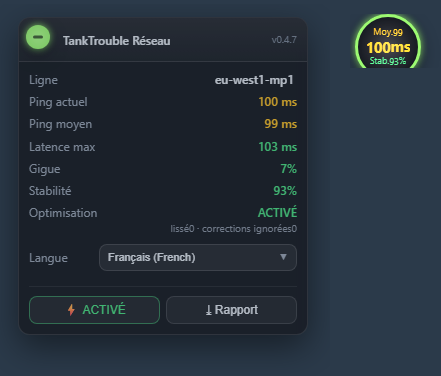

# 🇫🇷 TankTrouble — optimisation réseau

> [!TIP]
> Envie d'écrire **en français** dans TankTrouble ? J'ai fait une extension de chat multilingue ! 👉 [TankTrouble-Chat-Unblock](https://github.com/L-Shy-P/TankTrouble-Chat-Unblock)

> Plus riche, plus temps réel et plus précis : l'état du réseau, et une vraie optimisation.

Un userscript Tampermonkey pour **tanktrouble.com**. Il montre ce que fait vraiment votre connexion et transforme les « blocages → téléportation » du blocage de tête de file TCP en un glissement fluide.

**Pas de serveur, aucune configuration réseau, pas un VPN.** Tout est côté client : le serveur voit exactement les mêmes octets.

L'optimisation ne change que *ce que vous voyez* : la position est lissée au moment du rendu, tandis que la logique, la physique et la validation serveur utilisent toujours les vraies valeurs. Votre tank est localement autoritaire : pas de retour en arrière après une reconnexion.

## Installation en un clic · Features

| | |
|---|---|
| Plus riche | ligne / moyenne / actuel / maximum / gigue / blocages / stabilité en direct |
| Plus temps réel | sonde ping dédiée toutes les 2 s : le vrai RTT, pas les intervalles d'images |
| Plus précis | les vrais blocages (tête de file TCP) sont séparés des pauses du lobby |
| Optimisation | lissage au rendu + autorité locale + extrapolation, avec interrupteur A/B |

## Installation en un clic

👉 **[Tutoriel d'installation](install/fr.md)** · [⬇ raw script](https://raw.githubusercontent.com/L-Shy-P/TankTrouble-Network-Optimization/main/tanktrouble-netlab.user.js)

## Liens

* [Repository](https://github.com/L-Shy-P/TankTrouble-Network-Optimization) · [Tutoriel d'installation](install/fr.md) · [Technical notes (中文)](TECHNICAL.zh.md)

[🇬🇧 English](en.md) · [🇨🇳 中文](zh.md) · [🇯🇵 日本語](ja.md) · [🇰🇷 한국어](ko.md) · [🇷🇺 Русский](ru.md) · [🇸🇦 العربية](ar.md) · <b>🇫🇷 Français</b> · [🇪🇸 Español](es.md) · [🇩🇪 Deutsch](de.md) · [🇧🇷 Português](pt.md)

