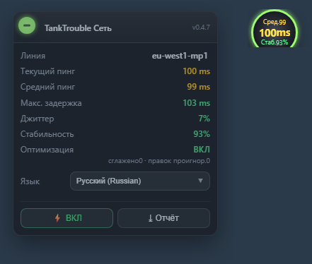

# 🇷🇺 TankTrouble — оптимизация сети

**Хотите писать **по-русски** в TankTrouble? Я сделал многоязычное расширение для чата! 👉 https://github.com/L-Shy-P/TankTrouble-Chat-Unblock**

> Богаче, актуальнее и точнее: состояние сети плюс настоящая оптимизация.

Пользовательский скрипт Tampermonkey для **tanktrouble.com**. Показывает реальное состояние соединения и превращает «зависание → телепорт» (блокировку головы очереди TCP) в плавное скольжение.

**Без сервера, без настройки сети, это не VPN.** Только клиент: сервер видит те же байты, что и раньше.

Оптимизация меняет только *то, что вы видите*: сглаживается позиция в момент отрисовки, а логика, физика и проверка на сервере всегда используют истинные значения. Ваш танк — локально авторитетный, поэтому после переподключения вас не отбросит назад.

## Установка в один клик · Features

| | |
|---|---|
| Богаче | линия / средний / текущий / максимум / джиттер / сталы / стабильность в реальном времени |
| Реальнее | отдельный ping-зонд каждые 2 с: настоящий RTT, а не интервалы кадров |
| Точнее | «настоящие сталы» (блокировка головы очереди) отделены от простоя в лобби |
| Оптимизация | сглаживание при отрисовке + локальный авторитет + экстраполяция, с переключателем A/B |

## Установка в один клик

👉 **[Руководство по установке](install/ru.md)** · [⬇ raw script](https://raw.githubusercontent.com/L-Shy-P/TankTrouble-Network-Optimization/main/tanktrouble-netlab.user.js)

## Ссылки

* [Repository](https://github.com/L-Shy-P/TankTrouble-Network-Optimization) · [Руководство по установке](install/ru.md) · [Technical notes (中文)](TECHNICAL.zh.md)

[🇬🇧 English](en.md) · [🇨🇳 中文](zh.md) · [🇯🇵 日本語](ja.md) · [🇰🇷 한국어](ko.md) · <b>🇷🇺 Русский</b> · [🇸🇦 العربية](ar.md) · [🇫🇷 Français](fr.md) · [🇪🇸 Español](es.md) · [🇩🇪 Deutsch](de.md) · [🇧🇷 Português](pt.md)

