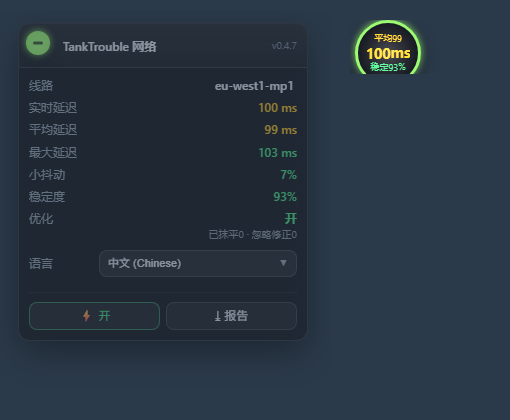

# 🇨🇳 TankTrouble 网络优化

> [!TIP]
> 想要在 TankTrouble 里发送 **中文** 吗？我做了一款多语言聊天扩展！👉 [TankTrouble-Chat-Unblock](https://github.com/L-Shy-P/TankTrouble-Chat-Unblock)

> 更丰富、更实时、更准确的网络情况显示，以及真正的网络优化。

给 **tanktrouble.com** 写的油猴脚本：把你这局的网络情况如实显示出来，并把 TCP 队头阻塞造成的「僵住 → 瞬移」抹平成滑行。

**不用服务器、不用改任何网络配置、不是加速器**：纯客户端，服务端看到的数据一个字节都没变。

优化只改**你看到的东西**：渲染那一瞬间的位置被平滑，游戏逻辑 / 物理 / 服务端校验全程用真值；你自己的坦克以本地为准，断线重连不会被拉回去。

## 一键安装 · Features

| | |
|---|---|
| 更丰富 | 线路 / 平均 / 实时 / 最大 / 小抖动 / 卡顿 / 稳定度，实时刷新 |
| 更实时 | 独立的 2 秒 ping 探测，量的是真 RTT，不是帧间隔 |
| 更准确 | 把「真卡顿（队头阻塞）」和「大厅/局间空闲」分开算 |
| 真优化 | 渲染期平滑 + 本地权威 + 静默外推，开关可实时 A/B 对比 |

## 一键安装

👉 **[安装教程](install/zh.md)** · [⬇ raw script](https://raw.githubusercontent.com/L-Shy-P/TankTrouble-Network-Optimization/main/tanktrouble-netlab.user.js)

## 相关

* [Repository](https://github.com/L-Shy-P/TankTrouble-Network-Optimization) · [安装教程](install/zh.md) · [Technical notes (中文)](TECHNICAL.zh.md)

[🇬🇧 English](en.md) · <b>🇨🇳 中文</b> · [🇯🇵 日本語](ja.md) · [🇰🇷 한국어](ko.md) · [🇷🇺 Русский](ru.md) · [🇸🇦 العربية](ar.md) · [🇫🇷 Français](fr.md) · [🇪🇸 Español](es.md) · [🇩🇪 Deutsch](de.md) · [🇧🇷 Português](pt.md)

